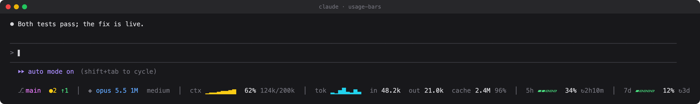
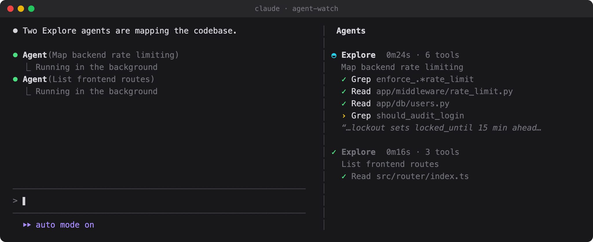

# claude-code-mods

Two small [Claude Code](https://claude.com/claude-code) mods (function-hook plugins) as a plugin marketplace.

## usage-bars

One row under the prompt, refreshed after every turn:



| Group | Shows |
|---|---|
| `⎇` | git branch, `●` uncommitted files, `↑`/`↓` commits ahead of / behind upstream, `✓` when clean |
| `◆` | the model the main loop runs and its effort level |
| `ctx` | context-window fill: one bar per turn, then the live % and tokens / window |
| `tok` | tokens each turn processed (bars), then session totals: uncached input, output, cache reads and the cache hit rate (subagents included) |
| `5h` / `7d` | your rate-limit windows: % used and time until reset (subscription accounts) |

Charts turn yellow from 60 % and red from 85 %. The row wraps on narrow terminals.

## agent-watch

When a subagent starts, a narrow pane docks beside the transcript and follows each agent live: type, elapsed time, tool count, its latest tool calls (`›` running, `✓` / `✗` done) and the tail of what it is writing. Finished agents collapse to one line; the pane closes itself 20 s after the last one ends.



The pane opens on its own from 144 terminal columns (a Claude Code rule for panes nobody asked for); on a narrower terminal run `/agents-pane`.

## Install

```
/plugin marketplace add AndreasOA/claude-code-mods
/plugin install usage-bars@ao-claude-mods
/plugin install agent-watch@ao-claude-mods
```

Restart Claude Code (or open a new session) to load them. `/plugin marketplace update ao-claude-mods` pulls new versions.

## Develop

Each plugin is `plugins/<name>/` with `hooks/register.tsx`, its state contract in `types/index.d.ts` and tests in `tests/`.

```
claude plugin validate plugins/usage-bars
claude plugin test plugins/usage-bars
claude --plugin-dir plugins/usage-bars   # load a working copy, hot-reloaded on save
```

The images in `docs/` are illustrations of the layout, not screenshots.

## License

MIT
